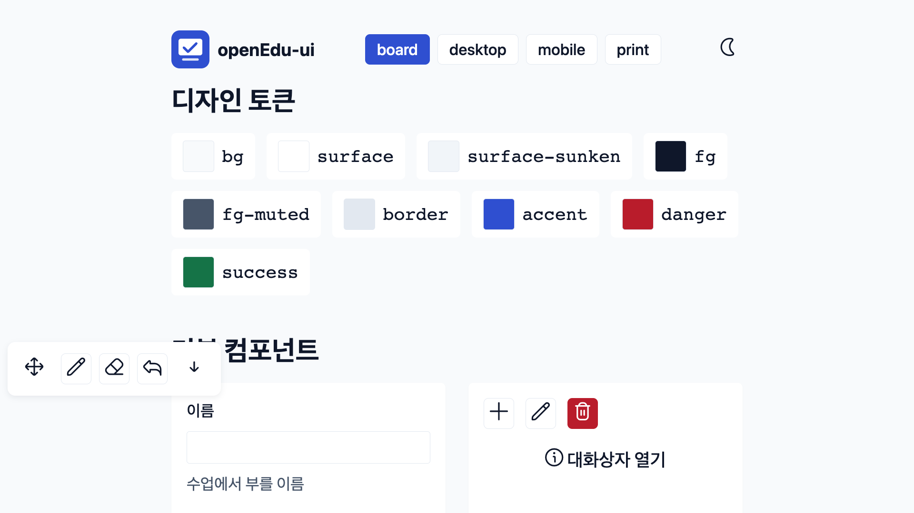
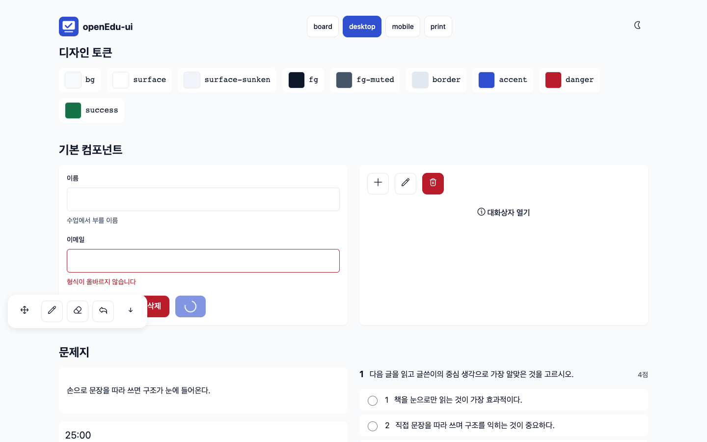
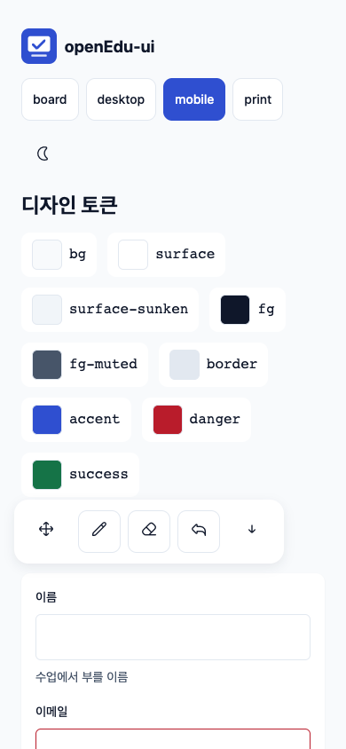

# openEdu-ui

전자칠판 · 웹 · 앱 · 인터랙티브 콘텐츠 · 종이 학습지까지, 교육 자료를 위한 디자인 시스템입니다.

하나의 **디자인 토큰**과 하나의 **문항 스키마**를 기준으로, 표면(`board` / `desktop` / `mobile` / `print`)만 고르면 글자 크기·간격·터치 타겟이 자동으로 맞춰집니다.

> 상태: 설계 단계입니다. 구현 계획은 [ROADMAP.md](./ROADMAP.md), 디자인 규칙은 [DESIGN.md](./DESIGN.md)를 참고하세요.

## 목표

- 디자이너 없이도 일관되고 읽기 쉬운 화면 (4/8pt 스케일, 시맨틱 컬러 토큰)
- 전자칠판 환경: 큰 터치 타겟, 도달성을 고려한 도크, 가림막, 분할 칠판
- 문제지: 지문 고정 + 문항 스크롤, 답안 팔레트, QTI 부분집합 기반 문항 JSON
- 같은 문항 데이터를 화면과 A4 인쇄물에서 모두 렌더링
- 가상 교구(CPA 모형)와 판서 엔진 어댑터

## 기술 방향

React 19 + TypeScript + 순수 CSS, pnpm 워크스페이스(`@openedu/*`). 토큰은 CSS 변수로 빌드되어 프레임워크와 무관하게 쓸 수 있습니다.

## 쇼케이스

```bash
pnpm install
pnpm --filter showcase dev        # 개발 서버
pnpm capture                      # production 빌드 → 실제 Chrome으로 4개 표면 캡처·검사 (screenshots/)
pnpm print:sample                 # 샘플 학습지를 A4 PDF로 생성 (out/print/)
```

| 표면 | 화면 |
| --- | --- |
| board |  |
| desktop |  |
| mobile |  |

## 아이콘

컴포넌트는 [Flaticon UIcons](https://www.flaticon.com/uicons) Regular Rounded(`fi fi-rr-*`) 클래스를 사용합니다. 아이콘 글꼴은 이 저장소에 포함하지 않으며, 사용하는 쪽에서 `@flaticon/flaticon-uicons`를 설치해 Flaticon 라이선스(출처 표기 등)에 따라 사용해야 합니다. 이 저장소의 MIT 라이선스는 아이콘 글꼴에 적용되지 않습니다.

## 라이선스

[MIT](./LICENSE)
